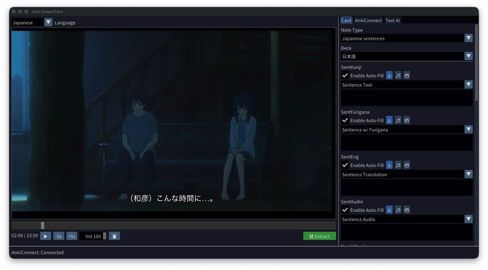
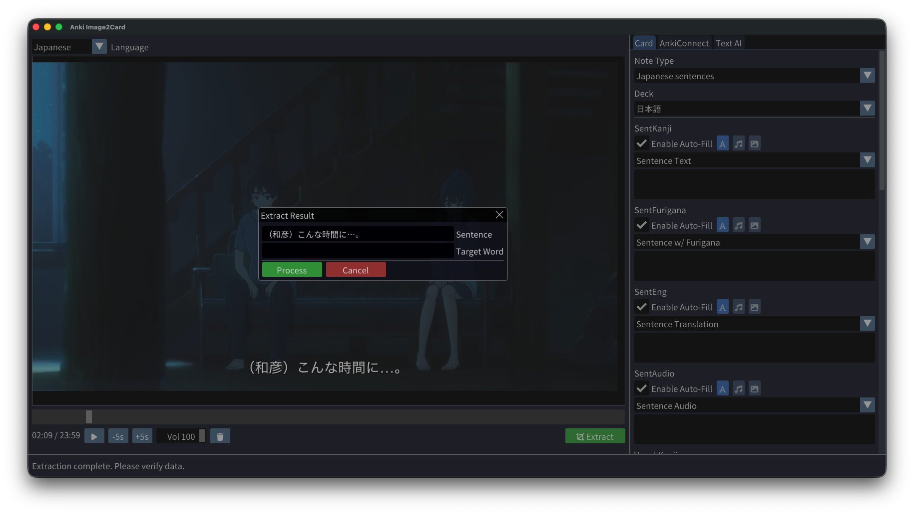
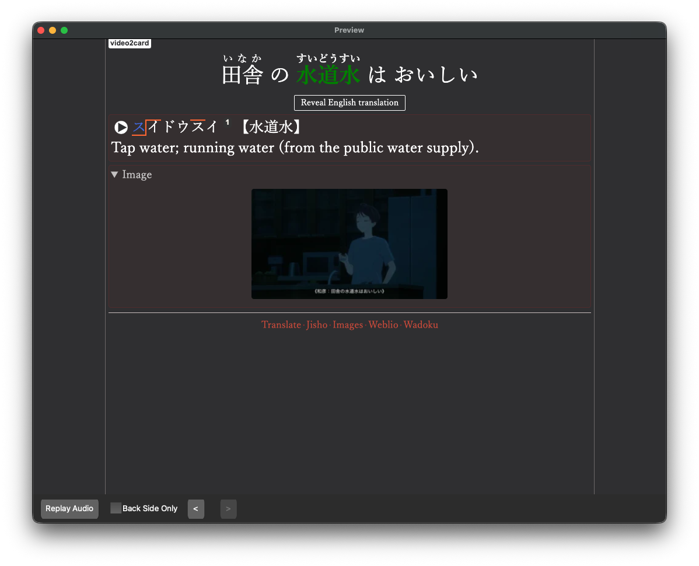

# Anki Video2Card

Anki Video2Card is a modern C++23 cross-platform desktop application designed to streamline the process of creating high-quality Anki cards directly from video files. It uses local morphological analysis and dictionary lookups to automatically extract and annotate Japanese text from your favorite anime, movies, or shows.

## Features

- **Modern C++23**: Built with C++ standards for performance and type safety.
- **Cross-Platform**: Runs on macOS, Windows, and Linux.
- **Beautiful UI**: Built with SDL3 and Dear ImGui for a responsive and intuitive interface.
- **Video Player**: Integrated high-performance video player based on **libmpv**.
- **Smart Extraction**:
  - **Snapshot**: Instantly captures the current video frame as the card image.
  - **Audio**: Extracts audio clips in OGG/Vorbis format corresponding to the current subtitle or timestamp using **FFmpeg**.
  - **Subtitles**: Automatically extracts the current subtitle text.
- **Local Text Analysis**:
  - **Morphological Analysis**: Uses Mecab for accurate word segmentation and dictionary forms.
  - **Furigana Generation**: Automatically generates ruby text annotations for kanji.
  - **Dictionary Lookups**: Local JMDict dictionary for word definitions.
  - **Pitch Accent**: Automatically looks up and displays Japanese pitch accent patterns using NJAD database.
- **Anki Integration**: Connects directly to Anki via AnkiConnect to create cards automatically.
- **Smart Fields**: Automatically detects and fills fields like Sentence, Target Word, Furigana, Pitch Accent, and Definitions.

## Screenshots





## Shortcuts

- **Space**: Play/Pause
- **Right Arrow**: Seek forward 5s
- **Left Arrow**: Seek backward 5s
- **M**: Extract current scene (Image + Audio + Subtitle)

## Getting Started

### Installation

See the [Installation Guide](docs/installation.md) for detailed instructions on installing dependencies for your platform (macOS, Linux, or Windows).

### Building

See the [Building Guide](docs/building.md) for step-by-step instructions on building the application from source.

### Quick Start

For experienced users:

```bash
git clone https://github.com/DaveMcMartin/anki-video2card.git
cd anki-video2card
python3 scripts/download_translation_model.py
python3 scripts/convert_pitch_accent.py
mkdir build && cd build
cmake ..
cmake --build .
```

## Project Structure

- `src/` - Main application source code
  - `core/` - Core functionality
  - `ui/` - User interface components (VideoSection, etc.)
  - `ai/` - AI integration modules
  - `api/` - API clients (AnkiConnect)
  - `config/` - Configuration management
  - `language/` - Language utilities
  - `utils/` - Utility functions
- `cmake/` - CMake build scripts and utilities
- `assets/` - Application assets (icons, etc.)

## Usage

1. **Configuration**:
   - Go to the "AnkiConfiguration" tab.
   - Set up your AnkiConnect URL (default is usually `http://localhost:8765`).
   - On the Card tab, select the Note Type, deck, and fields you want to fill.

2. **Card Creation**:
   - Drag and drop a video file into the Video Player section.
   - Navigate to the scene you want to mine.
   - Press **M** or click the **EXTRACT** button.
   - The application will capture the current frame, the audio clip for the subtitle, and the subtitle text.
   - A modal will appear allowing you to edit the extracted sentence or specify a target word.
   - Click "Process" to send the data to the AI for analysis.
   - Review the generated fields in the "Anki Card Settings" section.
   - Click "Add" to create the card in Anki.

## FAQ

1. **Which Note Type do you use?**
   The "Japanese Sentence" note type from the Ankidrone Foundation deck is recommended, but you can map fields to any note type.

## Dependencies

- **SDL3**: Cross-platform graphics and input handling.
- **ImGui**: Immediate-mode GUI framework with docking support.
- **nlohmann/json**: Modern JSON library for C++.
- **cpp-httplib**: Lightweight HTTP client library.
- **FFmpeg**: Video and audio processing library (with Vorbis codec support).
- **libmpv**: Media player library.
- **Mecab**: Japanese morphological analyzer.
- **CTranslate2**: Fast inference engine for Transformer models (local translation).
- **SQLite3**: Database engine for dictionary and pitch accent lookups.

## License

This project is licensed under the GNU General Public License v3.0 (GPLv3). See the LICENSE file for details.

## Planned Features

This is a work in progress. Here are some planned features, it is not in priority order:

- [ ] Github Action on release that generates binaries for Windows, macOS, and Linux.
- [x] Implement pitch accent generation from NJAD database
- [x] Add support for multiple dictionary sources including local and online sources
- [x] Improve furigana handling for edge cases
- [x] Audio fetching from online sources (Forvo, NHK, etc)

## Contributing

Contributions are welcome! Please feel free to submit issues and pull requests to improve the project.
